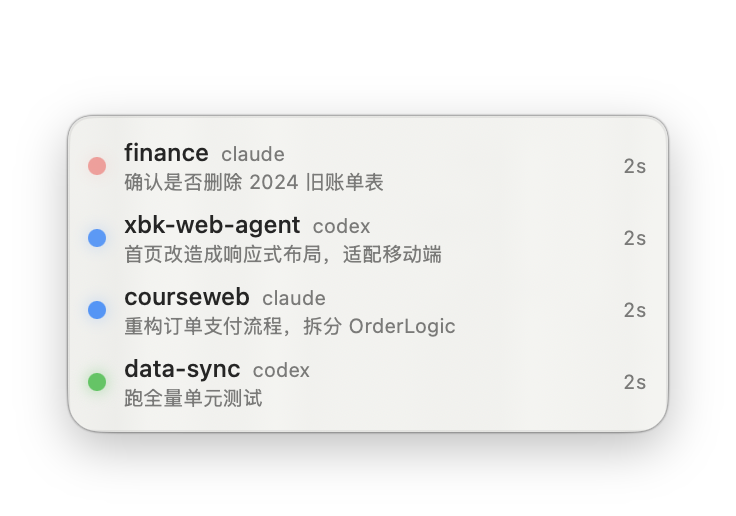
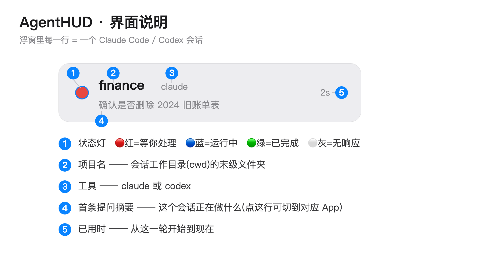
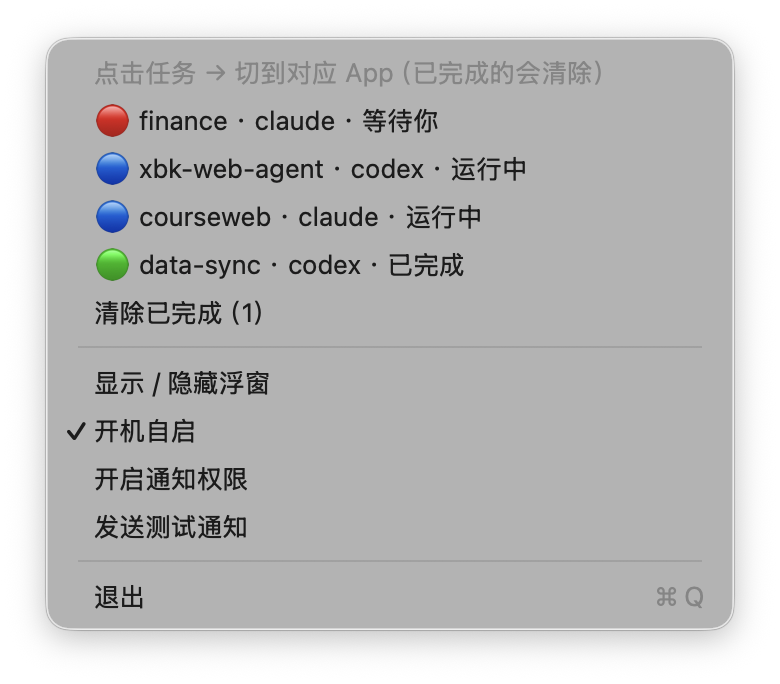
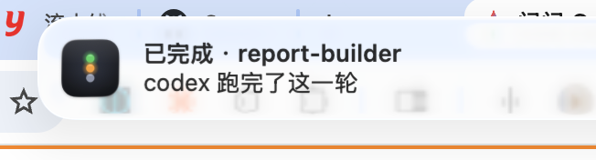
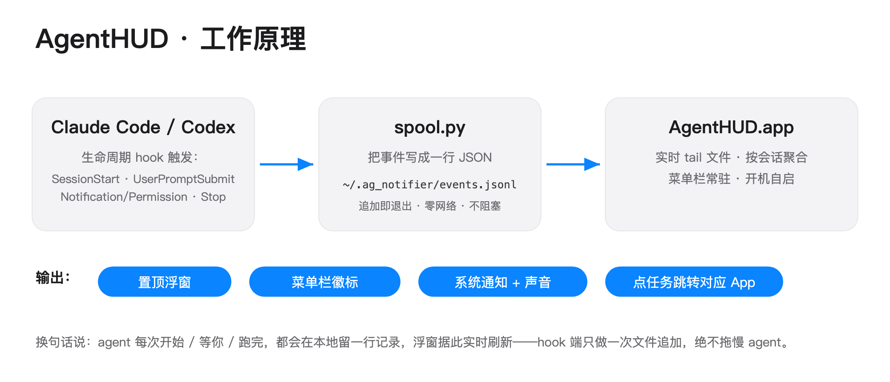

<!-- 语言：**中文** · [English](README.en.md) -->

# AgentHUD

一个极简的 macOS 菜单栏 App + 始终置顶的浮窗，实时显示你的 **Claude Code** 和
**Codex** 会话状态——不用在一堆终端窗口里翻找，一眼就知道哪个任务在跑、哪个在等你、
哪个刚跑完。

原生 Swift（AppKit + SwiftUI），零第三方依赖。仅菜单栏（无 Dock 图标），开机自启。

## 界面截图

浮窗——每行一个会话，「等你处理」的自动排在最上面：



每一行的含义：



| 菜单栏徽标 | 下拉菜单 | 系统通知 |
|---|---|---|
|  |  |  |

有任务等你时，徽标变红并显示待处理数；下拉菜单列出所有任务（点击切到对应 App），
还有「清除已完成」「开机自启」和通知相关的开关。

## 显示什么

一个紧凑的浮窗钉在屏幕右上角，每行一个会话：

```
🔵 courseweb  claude            1m20s
   修复支付回调超时并补充失败重试日志
🔴 xbk-web-agent  codex         12s
   把首页改成响应式布局，适配移动端
```

- **第一行** —— 项目名（会话工作目录 cwd 的末级文件夹）+ 工具
- **第二行** —— 该会话最新的提问（agent 正在做什么）
- **右侧** —— 已用时

### 状态颜色

| 灯 | 状态 | 含义 |
|-----|-------|---------|
| 🔴 红（闪烁） | `waiting` | agent 需要你——输入或批准 |
| 🔵 蓝（呼吸） | `running` | agent 正在干活 |
| 🟢 绿 | `done` | 这一轮跑完了 |
| ⚪ 灰（变淡） | `stale` | 运行中但超过 120 秒无事件（终端被关 / 进程被杀） |

菜单栏图标是全局汇总：有「等你」就红色 + 待处理数；否则有「在跑」就蓝色 + 运行数；
都没有则空闲。点任意任务（浮窗里或菜单里）即可切到它对应的 App（Claude.app /
Codex.app）。

## 工作原理



```
Claude Code hooks ─┐
                   ├─► spool.py <tool> <state>  ──► ~/.ag_notifier/events.jsonl
Codex hooks ───────┘     (从 stdin 读 hook 的 JSON)          │ (实时 tail)
                                                             ▼
                                                   AgentHUD.app
                                          (菜单栏 + 置顶浮窗 + 系统通知)
```

每个生命周期事件，hook 都往一个 spool 文件追加一行 JSON；App 实时 tail 这个文件并按
`tool/session_id` 聚合。hook 端是「追加即走」（只做一次本地文件追加），绝不阻塞或拖慢
agent。

## 环境要求

- macOS 14+
- Xcode 或命令行工具（`swift`、`actool`、`codesign`）

## 构建与安装

```bash
bash make-icon.sh   # 把 AppIcon.svg 渲染成 iconset / Assets.xcassets（只在改图标时需要）
bash build.sh       # 编译、组装 AgentHUD.app、ad-hoc 签名、安装到 ~/Applications
open ~/Applications/AgentHUD.app
```

`build.sh` 是幂等的——改完任何源码重跑即可。App 首次启动会自动注册为登录项（开机自启）。

## Hook 接入

1. 拷贝 spool 脚本并赋可执行权限：

   ```bash
   mkdir -p ~/.ag_notifier
   cp hooks/spool.py ~/.ag_notifier/spool.py
   chmod +x ~/.ag_notifier/spool.py
   ```

2. **Claude Code** —— 加到 `~/.claude/settings.json`（路径用你自己的绝对家目录）：

   ```json
   "hooks": {
     "SessionStart":     [{ "matcher": "*", "hooks": [{ "type": "command", "command": "/usr/bin/python3 /Users/<你>/.ag_notifier/spool.py claude running" }] }],
     "UserPromptSubmit": [{ "matcher": "*", "hooks": [{ "type": "command", "command": "/usr/bin/python3 /Users/<你>/.ag_notifier/spool.py claude running" }] }],
     "Notification":     [{ "matcher": "*", "hooks": [{ "type": "command", "command": "/usr/bin/python3 /Users/<你>/.ag_notifier/spool.py claude waiting" }] }],
     "Stop":             [{ "matcher": "*", "hooks": [{ "type": "command", "command": "/usr/bin/python3 /Users/<你>/.ag_notifier/spool.py claude done" }] }]
   }
   ```

3. **Codex** —— 加到 `~/.codex/config.toml`（然后信任这些 hook；已有的 `notify` 行保持不动）：

   ```toml
   [[hooks.UserPromptSubmit]]
   [[hooks.UserPromptSubmit.hooks]]
   type = "command"
   command = "/usr/bin/python3 /Users/<你>/.ag_notifier/spool.py codex running"

   [[hooks.PermissionRequest]]
   [[hooks.PermissionRequest.hooks]]
   type = "command"
   command = "/usr/bin/python3 /Users/<你>/.ag_notifier/spool.py codex waiting"

   [[hooks.Stop]]
   [[hooks.Stop.hooks]]
   type = "command"
   command = "/usr/bin/python3 /Users/<你>/.ag_notifier/spool.py codex done"
   ```

   > Codex CLI 的 `exec`（headless）模式不触发生命周期 hook——只有交互式会话才会触发。

## 改哪里

| 想改什么 | 文件 |
|----------------|------|
| 颜色 / 状态灯动画 / 提问摘要行 | `Sources/AgentNotifier/TaskListView.swift` |
| stale 阈值（120s）、done 自动清除、聚合、噪音过滤 | `Sources/AgentNotifier/TaskStore.swift` |
| 菜单栏图标 + 下拉菜单 | `Sources/AgentNotifier/StatusItemController.swift` |
| 通知文案 / 声音 | `Sources/AgentNotifier/Notifier.swift` |
| 任务点击跳转到哪个 App | `Sources/AgentNotifier/AppActivator.swift` |
| 浮窗位置 / 尺寸 | `Sources/AgentNotifier/PanelController.swift` |
| spool 行格式 / 事件→状态映射 | `hooks/spool.py` + 上面的 hook 配置 |

## 许可

个人项目，随意使用。
